# TARS_GO-哨岗视觉定位算法

```
ICRA2020-JLU-TARS_GO-Perception/
├── README.md                            #说明文档
├── test_video.mp4                       #测试流程视频
├── function.h                           #哨岗功能头文件（实战）
├── main.cpp                             #主函数（实战）
├── test.cpp                             #测试函数
├── pics                                 #图片文件
│   ├── set_location_points.jpg          #标定示例
│   ├── test_image.jpg                   #测试图片
│   ├── cos1.jpg                         #余弦相似度示意图
│   ├── cos2.jpg                         #余弦相似度公式
│   ├── judge_area.png                   #共同检测区域
│   ├── KalmanFilter.png                 #卡尔曼滤波公式
│   ├── test_image.jpg                   #测试图片
│   ├── model1.jpg                       #误差分析示例1
│   ├── model2.jpg                       #误差分析示例2
│   ├── outcome1.png                     #误差分析结果1
│   ├── outcome2.png                     #误差分析结果2
│   ├── transform.png                    #透视变换矩阵计算
│   ├── xy.jpg                           #变换后xy坐标
│   ├── robort_detection.png             #机器人识别示例
│   ├── KalmanFilter_test.jpg            #卡尔曼滤波效果图
│   ├── software_framework.png           #软件框架图
│   ├── test_result.jpg                  #测试效果图
```


## 依赖工具

基于C++语言，利用Opencv实现哨岗相机对敌方机器人的识别、跟踪与全局定位，通过WLAN实现与机器人的通讯；

程序依赖工具如下：

* Flycapture2(仅实战使用)
* opencv==3.4.6


## 内容简述

本程序利用场地对角两台哨岗摄像头对全局进行实时图像采集与敌我识别，通过透视变换计算并向我方机器人传输敌人在全局场地下的二维坐标位置。本程序主要包含以下五个功能模块：

- 红色车、蓝色车灯条检测模块（余弦相似度）

- 敌我全局定位模块（透视变换）

- 双哨岗误差校正模块（相互矫正区域取平均值）

- 基于卡尔曼滤波车辆位置跟踪模块

- 哨岗与机器人之间的通讯传输（WLAN）

  

  软件架构如下图所示

  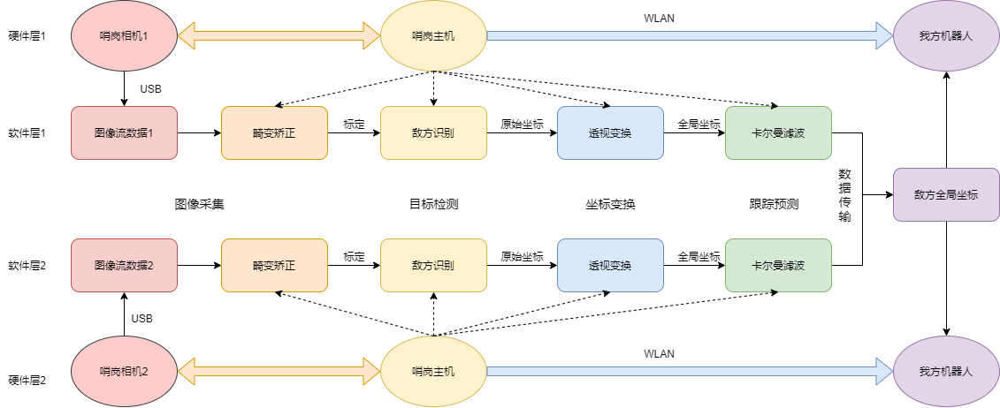

  


各模块简要介绍如下（本算法理论基础及感知部分算法介绍可见项目wiki）：

### 红色车、蓝色车灯条检测模块

* 通过RGB范围提取，以余弦相似度辅助，精准筛选红色、蓝色灯条。余弦相似度即通过求解两向量之间夹角的余弦来判断两向量之间的相似程度，越趋于1越相似（即两夹角趋于0，两向量重合）。
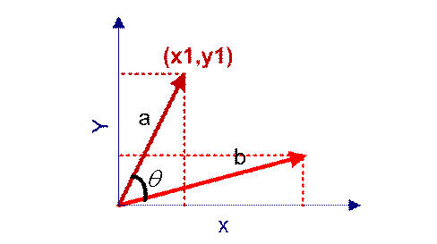
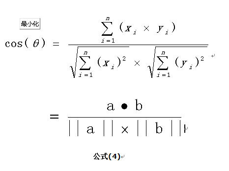

### 敌我全局定位模块

* 对相同颜色的灯条集合进行二值化处理，对灯条轮廓取最小外接矩形，以矩形中心之间的欧氏距离大小为条件，对所有同色灯条进行聚类，通过递归实现所有灯条坐标的的有效二分类。分别得到一组距离较远的和一组较近的灯条集合，即为场上敌方（我方）A/B两辆车的灯条集合。
* 对同一集合中所有的灯条坐标求算术平均，即为哨岗视角下的整车坐标。同一视角下有我方A/B车坐标以及敌方A/B车坐标
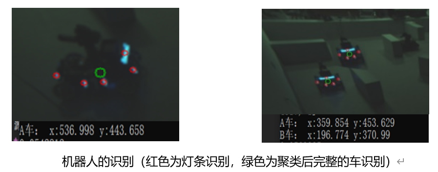
* 使用灯条聚类求算数平均作为整车坐标的原因：
  * 在原始图像尺寸1024x1024的情况下，机器人在视野中所占比例较小，尝试过装甲板或整车识别，但限制条件过多，精度低、速率慢，不适合哨岗识别
  * 采用灯条识别、距离聚类实现简单，代码执行效率高，且对于机器人部分遮挡情况下，由于灯条遍布全身，故依然能够及时识别，并保持识别准确率，符合哨岗工作要求

* 通过张正有标定法，标定哨岗相机，得到哨岗相机内参，矫正相机镜头的畸变
* 利用哨岗视角下的边缘四点标定，与全局地图的边缘四点，可算得透视变换矩阵Mask
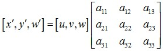
* 将我方A/B车坐标以及敌方A/B车坐标与Mask相乘，得到全局地图下的敌我机器人坐标
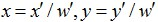

### 误差校正模块

* 由于装甲板与地面有高度差，哨岗相机与地面有高度差，透视变换后求得的装甲板中心与其实际平行投影到地面的中心有偏差，偏差量随着车辆与哨岗的距离增加而增加。通过对50组实际坐标与理论坐标的计算分析，总结出以下三种消除高度误差与偏移量误差的方法。

  * 由于障碍物遮挡和场地较大，一个哨岗相机难以实现对敌方车辆高精度定位。而双哨岗相机同时采集并相互校对可以较好解决这个问题。每个哨岗相机的精确定位区域是以哨岗为圆心半径为4m的扇形区域，在此区域产生的误差范围较小，且能有效地检测到障碍物前后的所有区域。除了两摄像头各自的精确区域，中间部位无交集部分划定为协同区域，也称作相互矫正区域。通过对两哨岗识别结果求算术平均，减小计算误差，提升定位准确率
 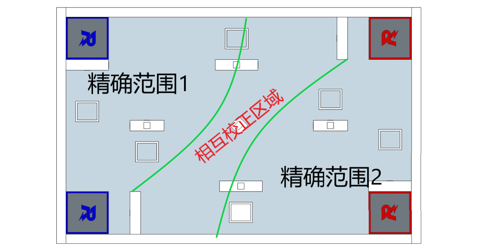
  * 将偏移量矢量分解为x方向和y方向，则偏移量随车辆位置坐标变化而变化。假设偏移量是线性增加的，将车辆分别沿x、y轴平移一定距离D，拍摄初始位置和平移后的位置。测量初始位置的偏移量 、沿x轴平移后的偏移量 和沿y轴平移后的偏移量 。设 沿x轴的分量为 ， 沿x轴的分量为 ，可得 ，其中， 为比例系数。同理，设 沿y轴的分量为 ， 沿y轴的分量为 ，可得 。由实验求得
   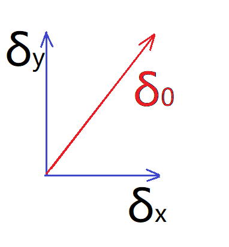
 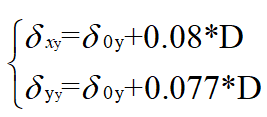
  * 建立关于哨岗、装甲板、地面的数学模型；O点为哨岗所在的坐标，定义为坐标原点。B点为哨岗相机所在的点，A点为装甲板中心点，C点为装甲板平行投影到地面的投影点，M点是装甲板中心A经仿射变换后的射影在地面的点，P点为车辆中心平行投影到地面的点。设哨岗相机高OB为H，装甲板中心高度CA为h，车的宽度为W。
   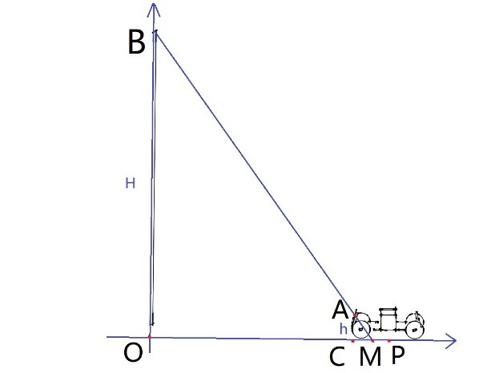
 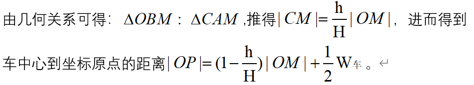

### 基于卡尔曼滤波车辆位置跟踪模块

* 首先计算k-1时刻对k时刻敌人坐标以及协方差的估计值，再计算k时刻的卡尔曼增益
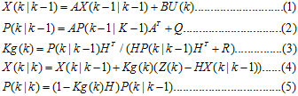
* 最后计算k时刻的最优坐标值以及对应的协方差，经过递归实时估算出下一时刻的位置
 
(蓝色标记为当前机器人的全局坐标，红色标记为卡尔曼滤波后对机器人下一位置的预测)
* 使用卡尔曼滤波又大大增加了对敌人位置预判的准确性与稳定性
### 哨岗与机器人之间的通讯传输

* 无线路由器通信，利用socket套接字发送位置信息。利用路由器搭建的局域网能够覆盖更大的通信范围，且传输速率比蓝牙等无线通信方式要快得多，且一旦连接成功，不会轻易中断，抗干扰性强。


## 软件效果展示

### 测试步骤

* 建立工程配置opencv，并添加test.cpp作为源文件，生成并调试
* 操作演示请看
* 在弹出的窗口中按照顺序单击选择4个边缘点，点击第五次显示透视变换矩阵，此时按ESC显示透视变换结果图。
  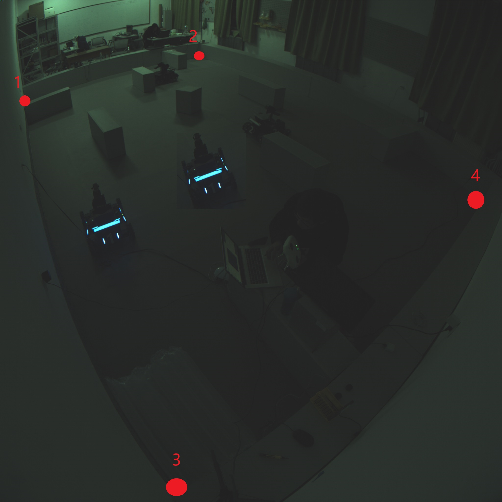
  


### 测试结果

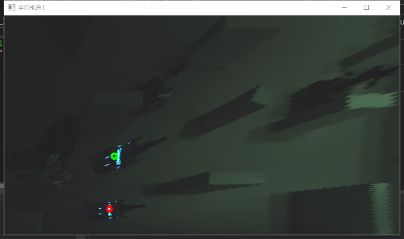


## 设计模式

测试：单例模式
实战：Master-Worker模式
