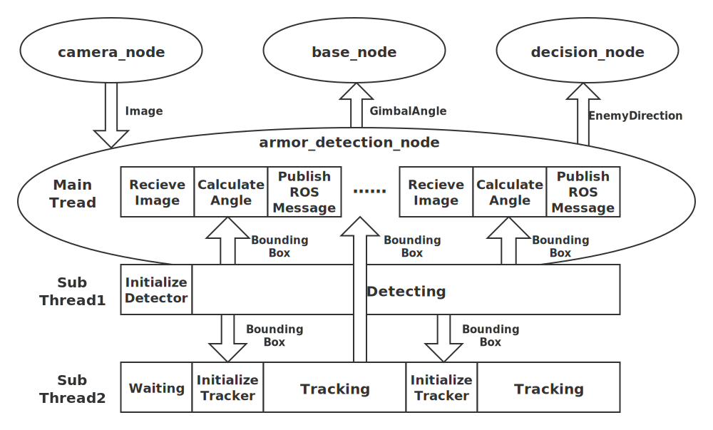

# Tars-Go Robomaster装甲车视觉检测程序

```
Robomaster-Detector/
├── detector.py                                 #目标检测检测类
├── tracker.py                                  #视觉跟踪类
├── armor_detection_node.py                     #ROS节点类
├── gimble_ctrl.py                              #相机模型及云台控制
├── README.md                                   #说明文档
├── requirements.txt                            #python依赖模块
├── test_video.mp4                              #测试视频
├── KCF                                         #核相关滤波算法模块
│   ├──build                                    #构建生成的pyhon模块
│   ├──python                                   #python接口文件
│   ├──src                                      #核相关滤波算法核心代码（C++）
│   ├──run.py                                   #python接口测试代码
│   ├──setup.py                                 #python模块构建代码
├── data                                        #神经网络模型权重及配置文件
│   ├── robomaster_trt.pb                       #神经网络权重文件
│   ├── label_map.pbtxt                         #模型类别索引
├── pics                                        #README中插入图片文件
│   ├── left_detection_right_groudtruthx.png    #检测结果与标注对比
│   ├── mAP.png                                 #模型平均精度
│   ├── train_loss.png                          #模型训练损失
│   ├── software_structure.svg                  #软件框架图
│   ├── test_result.gif                         #测试效果动态图
│   └──model_structure.png                      #模型结构图

```


## 依赖

* Ubuntu16.04
* ROS Kinetic
* python3.5
* rospy
* TensorFlow==1.14(with contrib)
* numpy
* opencv
* multiprocessing
* threading
* Queue
* cv_bridge
* 其他依赖模块详见./Robomaster_Detector/requirements.txt


## 整体介绍

本项目代码基于python语言和C++语言编写，采用UTF-8编码，符合python代码的风格规范。代码内容为机器人的视觉感知功能，主要是识别敌方机器人方位、敌方装甲板，精确测算敌方位置，并计算敌方相对于我方的位姿信息。

- **深度学习检测器（改进的SSD算法）**

- **目标跟踪器（核相关滤波算法）**

- **姿态解算与坐标变换模块（PNP算法）**

装甲车的视觉检测算法采用**基于深度学习的目标检测器+基于核相关滤波算法的目标跟踪器**的模式。

深度学习部分采用改进的SSD目标检测算法，以Googlenet为模型的主干，并消去了用于检测极小目标的分支、并利用模型剪枝技术以提升检测速度。同时，以并行的方式、采用核相关滤波算法对装甲板这一目标进行跟踪，辅助深度学习算法，弥补检测速度上的不足。

采用这样的模式，既可以实现深度学习算法强大的目标检测能力和抗干扰能力，又可以实现较高的实时性。经测试，该算法的平均检测速度可达到80FPS(12.5ms/frame)，满足机器人精确打击的需求。

- 软件架构与数据流如下图所示：
  
  


### 模块介绍
#### 深度学习检测器

* 采用改进的SSD目标检测算法，输入为300*300的RGB图，输出BoundingBox的位置、类别和置信度.
* 检测目标分为七个类别：红色装甲板(red)、蓝色装甲板(blue)、装甲车前方(front)、装甲车后方(back)、装甲车左方(left)、装甲车(right)、装甲车斜方(tracking).

* 模型训练的loss及mAP：
  
  

  

* 网络结构图(删除了小目标预测分支)：

  

* 效果图（左边为检测结果，右边为标注结果）
  
  
  
  
  
  

#### 目标跟踪器

* 采用核相关滤波算法，仅对敌方装甲板这一目标进行跟踪，以弥补深度学习算法检测速度的不足.
* 算法流程图
  


#### 姿态解算与坐标变换

* 通过相机的标定方法获得相机的内参矩阵
* 以装甲板的中心建立世界坐标系，采用PNP算法求解出相机的平移矩阵
$$T=
\left[
 \begin{matrix}
    r\\
    s\\
    t\\
  \end{matrix} 
\right]
$$
r、s、t表示装甲板中心与我方相机的相对位置。并根据 
$$pitch = atan2(s,t+offset)$$
$$yaw = atan2(r,t+offset)$$
求解出旋转角，进而控制云台转动.


## 软件测试步骤
从百度网盘下载模型文件和测试视频(提取码：oza7)：https://pan.baidu.com/s/1fQlVAZpAcXy9H3WGko5rCA 


**test.avi放在./robomaster_detector下，robomaster_trt.pb放在./robomaster_detector/model_data下**
### 单独测试深度学习目标检测功能

* 运行`pip install -r requirements.txt`安装相关依赖
* 在./Robomaster_Detector目录下，运行`python detector.py`

### 单独测试目标跟踪算法功能

* 在./Robomaster_Detector/KCF目录下，运行`python setup.py build_ext --inplace `
* 在./Robomaster_Detector目录下，运行`python tracker.py`
* 用鼠标框选要跟踪的装甲板即可

### ROS下armor_detection节点的综合测试
* 利用virtualenv建立python3虚拟环境，并安装tensorflow、opencv-python等依赖
* 基于Python3、从ROS Kinetic源码编译ROS
* 基于python3、从源码编译cv_bridge、tf等rospackages
* 基于python3编译EnemyDirection.msg、GimbalAngle.msg两个消息文件和ShootCmd.srv、FricWhl.srv两个服务文件
* 在./Robomaster_Detector目录下，运行`python armor_detection_node.py`


### 测试结果


## 设计模式

单例模式
